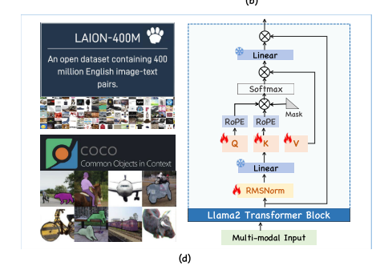

# **文献阅读**

## 1.EarthGPT: A Universal Multimodal Large Language
Model for Multisensor Image Comprehension in
Remote Sensing Domain

IEEE TRANSACTIONS ON GEOSCIENCE AND REMOTE SENSING, VOL. 62, 2024

遥感+多模态大模型MLLMs

### **MLLMs核心架构：**

1.视觉编码器：即擅长全局上下文建模提取空间结构的vit+擅长捕捉局部细节提取纹理边缘的CNN组成的视觉增强感知机制。提升图像的细粒度与粗粒度特征。

2.语言编码器：即将用户指令与问题等文本转为语言向量，供理解复杂语义

3.跨模态对齐模块：将图像特征与语言特征拼接成统一序列输入大模型。使用解冻部分自注意力和归一化层（避免全模型微调的计算成本），使语言模型可以识图。

### **具体任务评估：**

- 场景分类
- 图像描述
- 视觉问答
- 视觉定位
- 目标检测

多轮任务对话：相比传统模型可以通过自然语言“交互式逐步引导”模型完成多任务。

- 场景识别
- 生成图像描述 image captioning
- 回答用户提问
- 检测图中物体并描述
- 定位特定目标VG
- 对特定区域生成描述

***

### **图文对齐的关键技术点：**

1.视觉特征投影：cnn vit输出的是高维图像张量，需要通过线性层降维成语言模型可接受的1D向量

2.语言嵌入：文本通过分词+向量化，转换为嵌入向量

3.多模态融合输入：将视觉token与语言token拼接，作为LLM输入

4.部分参数解冻训练：仅解冻LLM中的关键参数（如注意力头、RMSNorm），避免训练开销过大

5.损失函数：使用语言建模任务中的“自回归损失”优化整体对齐能力

***

### **创新与核心内容**

1.提出一个统一架构的遥感多模态大模型earthgpt，可统一处理分类、图像描述、视觉问答、目标检测与视觉定位等任务。并可适应多模态输入如sar合成孔径雷达图像、红外与光学图像等。

2.关键技术组件：

- 融合了CNN与Vit提取全局与局部的特征，增强了遥感图像理解能力
- 跨模态相互理解机制：通过联合训练视觉与语言表示，实现图文对齐与深层交互理解
- 统一指令微调方法：通过大规模指令跟随数据集训练，实现模型跨任务理解和语言驱动的任务执行能力。

3.数据集构建：图文对of 遥感数据集

构建与作用：

- 现有遥感数据集大多是“单任务，单模态”，如只有分类标签或者目标框。而没有统一格式的数据，难以训练多任务多模态的MLLM。

数据构建方法与格式转化：

粗粒度任务（图像级）构建方式：

- 分类任务：转化为问题“这张图属于哪个类别？”
- 图像描述：“请用一句话描述图像”
- 视觉问答VQA：保留问答对，统一格式“请用一个词或者短语回答”

细粒度任务（区域级）构建方式：

- 目标检测：转换为“请标出图中所有目标，使用HBB水平边界框 OBB方向的边界框表达”
- 视觉定位VG：用户描述一个目标“模型返回区域坐标”，或用户提供区域坐标“模型生成该区域的文本描述”

4.广泛评估与实验验证：展示了在监督与零样本场景下的卓越泛化能力。

具体表现为两阶段策略：

第一阶段：跨模态对齐，数据来源是自然图像数据集。是为了对语言模型的关键层解冻，进行图文联合训练，即依托于自然图像的数据量与多样性大，可用于“教模型看图说话；

第二阶段：遥感图像视觉模式不同、任务语义专业，必须单独训练模型适应。在遥感领域微调可以让模型掌握遥感任务与语境，采用轻量的bias-tunning方法，在遥感任务中精调模型指令响应能力。

**这么做的原因：直接在遥感数据训练模型难以对图文理解进行有效初始化，因此需要先在通用数据上预训练，然后迁移到遥感。**两步培训中，采用了域转移学习策略将通用知识转移到RS领域。

==指令驱动学习：数据本身构成指令跟随样本，为语言引导任务执行提供基础。==

***

### **视觉的增强感知**

#### 多层空间上下文视觉感知

vit将输入的图像拆分为补丁序列，将扁平的贴片线性嵌入并添加到位置嵌入，并将位置向量馈送到标准的变压器解码器中。而后从不同的层中提取多层视觉中间特征V，以捕获远程上下文空间信息，即原始图像i被转换成了视觉表示Vi。将所有视觉提取的视觉特征沿通道维度加入，来自不同层的视觉特征融合有益于捕获RS图像中的细微差异，使得对图像有更全面的理解。

#### **多尺度本地详细的视觉感知**

CNN的输入包括多种空间分辨率，如h/4 * w/4   h/8 * w/4等，hw是原始输入图像分辨率。卷积块把各个输入转化为tokens Vb，而后将视觉特征V2 V3等进行上采样upsample，以匹配V1的特征分辨率，此时各视觉特征都会转化为相同的分辨率。而后将它们沿通道维度串联在一起。这么做会获得广泛的语义与复杂的信息。

将经由vit与cnn提取的视觉特征，使用可学习的投影层将视觉特征flatten为1-D向量，以便于后续与语言标记的对齐。而后按照通道方式连接多层和多尺度要素，新的视觉标记被视为Vp。

***

### **语言感知**

从上一环节获取了视觉tokens后，将语言指令转换为语言嵌入，并将其作为文本信息注入LLM。使用NLP的subword算法，将指令转化为子字，将子字转为为嵌入。而后使用Word2Vec技术将每个子字映射到1-D矢量嵌入。

注：subword的本质即拆分子词，解决OOV问题即将未见过的词也分解为已知的子词，获取之于符号合并后的似然增益使用贪婪算法匹配等；

Word2Vec是基于分布式假设，出现在相似上下文中的单词具有相似的含义，通过预测单词的上下文学习词向量表示。语义相似的词在向量空间中距离相近，得到的词向量具有线性特性。

***

### **跨模态相互理解**mutual comprehension

在当前的MLLM中，通过在frozen llm上训练来实现视觉语言理解，旨在避免昂贵的全参数微调。但这么做也会大大限制了全面cross comprehension的潜力。为了应对不同模式的知识差距的挑战并实现多模式相互理解，需设计一个unfrozen visual-language alignment strategy，即自注意力层与归一化层对于训练最常见的域数据是unfrozen的。

此方法将Llama2作为初始LLM，仅在不修改llama内部结构的情况下解开零件参数，RoPE模块是编码信息模块，mask即同transformer里的masked-self-attention模块作用是使得LLM生成当前位置的内容只能根据已经生成的内容，而组织模型查看卫生城的模块。Softmax函数将每个位置的分布概率转化为相应tokens的概率。这三个模块都是不断更新的，linear线性模块在训练阶段是frozen的。

将视觉向量V与语言向量L串联为X作为输入，Query、Key、Value同trans设置，X左乘各自的特征矩阵，RMS即归一化。

设置跨熵损失函数L, $\omega$i代表第i个词。在视觉语言对齐后，language-only LLM被转换为MLLM，其可以基于集成的多模式信息生成视觉解释响应。

***

### **同一结构微调**

经由前面的cross comprehension的训练后，此时的earthgpt具有自然领域的基本多模式推理与对话能力，并努力遵循指示并在上述阶段对RS下游任务执行推断。为了增强其适用性即将自然领域扩展到RS领域，开发MMRS数据集，将所有下游任务转化为VQA指令的格式。

为了保留上个阶段获得的visual captioning能力并同时增强对任务指令的遵守，将权重从cross comprehension阶段frozen，并在线性层引入两个可学习的参数移位$\alpha$与修改$\beta$进行修改。

***

### **数据集创建**

多轮对话数据：核心要义是将现有的RS多任务数据集转化为：每个图像每轮对话的指令-答案对生成一个长的对话顺序。i即均匀的视觉指令遵循格式。

#### 粗粒度微调对话场景：

对应分类数据集、图像字幕数据集与VQA数据集：

1. 类别-指令：首先提取每个图像的类别，分别使用一个单词或者短语回答问题“此RS图像的类别是什么？”，参考类别即预先引入的数据集；
2. 字幕-指令：清洗数据集后，删除相同图像的重复字幕。回答问题“请为提供的RS图像详细地提供单句字幕”以描述图像。每个图像的字幕数决定了对话的轮次数量。将每个图像的多个字幕放入多轮对话框可以显著降低运算成本，同时保证图像的多样化描述不会损害信息泄露；
3. VQA-指令,visual question answering：在原始问题后，添加“使用单个单词或者短语回答问题”的指令，以控制答案的输出格式。根据图像，问答对的数量决定了对话的对话轮次数。此多轮对话框使得模型可以从图像中提取和解释足够的信息；

#### 细粒度微调对话场景：

对应光学、SAR与红外对象数据集：

1. 对象检测-指令：即HBB格式与OBB格式。
   HBB格式是把边框定义为[Xmin Ymin Xmax Ymax]，即分别代表边界框的角点，分别距离坐标原点最接近与 最远。
   OBB格式则是[X1 Y1 X2 Y2 X3 Y3 X4 Y4]，X1 Y1代表最接近坐标原点的边界框的角点，其余三个点根据第一个点的角度按升序排序。

   对于二者的检测，坐标都被标准化。问题即“检测RS图像中显示的所有对象并用OBB/HBB描述”。

2. Visual Grounding-指令：构建了两种对话格式。
   第一种格式描述了感兴趣的区域并对MLLM提供了指示以找到相应的目标，而后输出确定目标的坐标。
   第二种格式涉及用户输入指令，以根据其空间位置坐标描述目标区域，MLLM生成相应目标区域的描述。
   第一种被用来执行视觉定位，第二种用来完成区域字幕任务。

***

### **实操**

采用off-the-shelf现成的13B模型Llama2，跨模式交互理解16张A100用了258h,统一的指令调整阶段16张A100用了96h。最长的训练序列长度设置为3072.

采用的数据集是NWPU-RESISC45，西北理工大学大规模公开数据集，用于RS图像场景分类。由45个场景类别组成，每个类别包含700个RS图像，像素是256*256,80%的数据集用作测试集。

